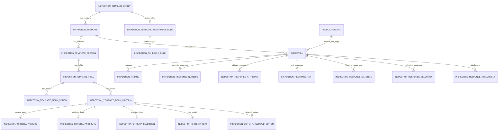

# 01. Inspection Forms ER Diagram

Source: `docs/01_database_schema_design.md` — ## Entity Relationship Overview

```mermaid
erDiagram
    INSPECTION_TEMPLATE_FAMILY ||--o{ INSPECTION_TEMPLATE : has_revisions
    INSPECTION_TEMPLATE ||--o{ INSPECTION_TEMPLATE_SECTION : has_sections
    INSPECTION_TEMPLATE_SECTION ||--o{ INSPECTION_TEMPLATE_FIELD : has_fields
    INSPECTION_TEMPLATE_FIELD ||--o{ INSPECTION_TEMPLATE_FIELD_OPTION : has_options
    INSPECTION_TEMPLATE_FIELD ||--o{ INSPECTION_TEMPLATE_FIELD_CRITERIA : has_criteria

    INSPECTION_TEMPLATE_FIELD_CRITERIA ||--|| INSPECTION_CRITERIA_NUMERIC : numeric_detail
    INSPECTION_TEMPLATE_FIELD_CRITERIA ||--|| INSPECTION_CRITERIA_ATTRIBUTE : attribute_detail
    INSPECTION_TEMPLATE_FIELD_CRITERIA ||--|| INSPECTION_CRITERIA_SELECTION : selection_detail
    INSPECTION_TEMPLATE_FIELD_CRITERIA ||--|| INSPECTION_CRITERIA_TEXT : text_detail
    INSPECTION_TEMPLATE_FIELD_CRITERIA ||--o{ INSPECTION_CRITERIA_ALLOWED_OPTION : allowed_options

    INSPECTION_TEMPLATE_FAMILY ||--o{ INSPECTION_TEMPLATE_ASSIGNMENT_RULE : applies_when
    INSPECTION_TEMPLATE_ASSIGNMENT_RULE ||--o{ INSPECTION_SCHEDULE_RULE : scheduled_as

    PRODUCTION_RUN ||--o{ INSPECTION : anchors_due_logic

    INSPECTION_TEMPLATE ||--o{ INSPECTION : locks_revision
    INSPECTION ||--o{ INSPECTION_FINDING : produces

    INSPECTION ||--o{ INSPECTION_RESPONSE_NUMERIC : numeric_responses
    INSPECTION ||--o{ INSPECTION_RESPONSE_ATTRIBUTE : attribute_responses
    INSPECTION ||--o{ INSPECTION_RESPONSE_TEXT : text_responses
    INSPECTION ||--o{ INSPECTION_RESPONSE_DATETIME : datetime_responses
    INSPECTION ||--o{ INSPECTION_RESPONSE_SELECTION : selection_responses
    INSPECTION ||--o{ INSPECTION_RESPONSE_ATTACHMENT : attachments
```
