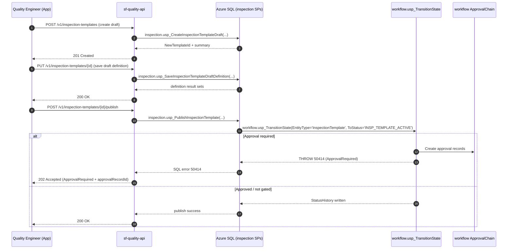

# 02. Template Publish Flow (Approval + Workflow)

Source: `docs/05_integration_architecture.md` — ## Integration: Template → Approval → Publish

```mermaid
sequenceDiagram
  autonumber
  participant QE as Quality Engineer (App)
  participant API as sf-quality-api
  participant DB as Azure SQL (inspection SPs)
  participant WF as workflow.usp_TransitionState
  participant APR as workflow ApprovalChain

  QE->>API: POST /v1/inspection-templates (create draft)
  API->>DB: inspection.usp_CreateInspectionTemplateDraft(...)
  DB-->>API: NewTemplateId + summary
  API-->>QE: 201 Created

  QE->>API: PUT /v1/inspection-templates/{id} (save draft definition)
  API->>DB: inspection.usp_SaveInspectionTemplateDraftDefinition(...)
  DB-->>API: definition result sets
  API-->>QE: 200 OK

  QE->>API: POST /v1/inspection-templates/{id}/publish
  API->>DB: inspection.usp_PublishInspectionTemplate(...)
  DB->>WF: workflow.usp_TransitionState(EntityType='InspectionTemplate', ToStatus='INSP_TEMPLATE_ACTIVE')

  alt Approval required
    WF->>APR: Create approval records
    WF-->>DB: THROW 50414 (ApprovalRequired)
    DB-->>API: SQL error 50414
    API-->>QE: 202 Accepted (ApprovalRequired + approvalRecordId)
  else Approved / not gated
    WF-->>DB: StatusHistory written
    DB-->>API: publish success
    API-->>QE: 200 OK
  end
```
