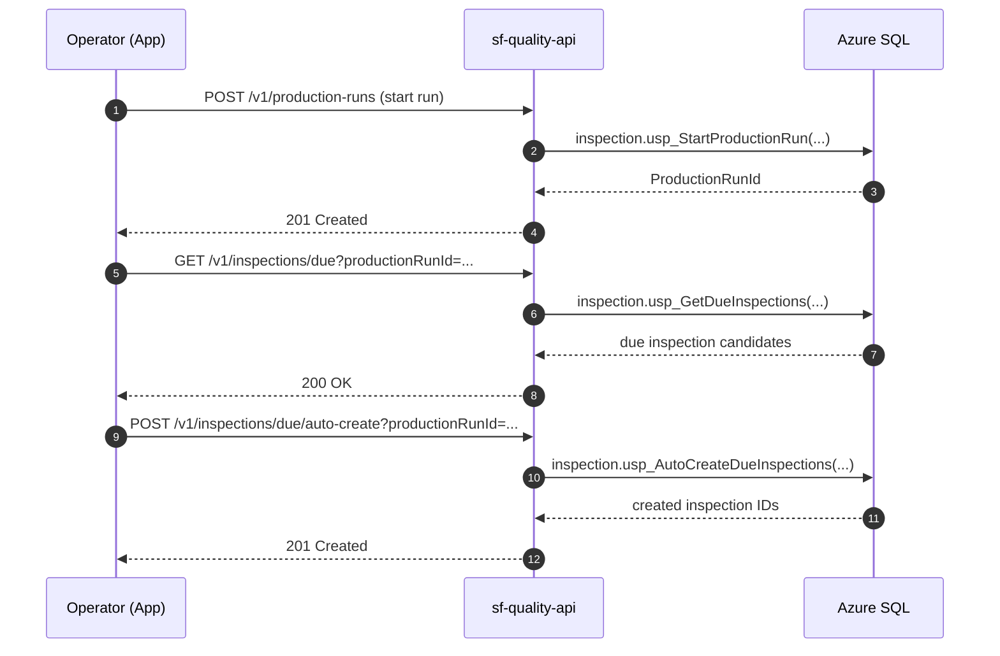

# 03. Scheduling Due Queue Flow (v1 manual ProductionRun)

Source: `docs/05_integration_architecture.md` — ## Integration: Scheduling → Due Queue (v1 manual production run)

```mermaid
sequenceDiagram
  autonumber
  participant OP as Operator (App)
  participant API as sf-quality-api
  participant DB as Azure SQL

  OP->>API: POST /v1/production-runs (start run)
  API->>DB: inspection.usp_StartProductionRun(...)
  DB-->>API: ProductionRunId
  API-->>OP: 201 Created

  OP->>API: GET /v1/inspections/due?productionRunId=...
  API->>DB: inspection.usp_GetDueInspections(...)
  DB-->>API: due inspection candidates
  API-->>OP: 200 OK

  OP->>API: POST /v1/inspections/due/auto-create?productionRunId=...
  API->>DB: inspection.usp_AutoCreateDueInspections(...)
  DB-->>API: created inspection IDs
  API-->>OP: 201 Created
```
