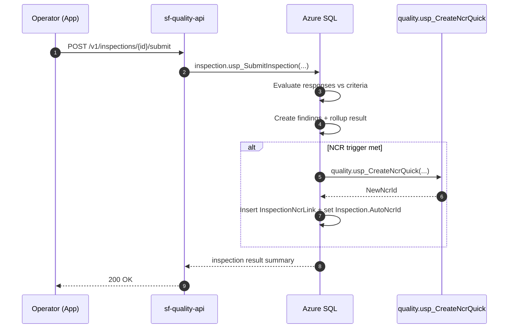

# 04. Submit Inspection → Evaluate → Optional NCR Auto-Create

Source: `docs/05_integration_architecture.md` — ## Integration: Submit Inspection → Evaluate → Optional NCR auto-create

```mermaid
sequenceDiagram
  autonumber
  participant OP as Operator (App)
  participant API as sf-quality-api
  participant DB as Azure SQL
  participant NCR as quality.usp_CreateNcrQuick

  OP->>API: POST /v1/inspections/{id}/submit
  API->>DB: inspection.usp_SubmitInspection(...)

  DB->>DB: Evaluate responses vs criteria
  DB->>DB: Create findings + rollup result

  alt NCR trigger met
    DB->>NCR: quality.usp_CreateNcrQuick(...)
    NCR-->>DB: NewNcrId
    DB->>DB: Insert InspectionNcrLink + set Inspection.AutoNcrId
  end

  DB-->>API: inspection result summary
  API-->>OP: 200 OK
```
