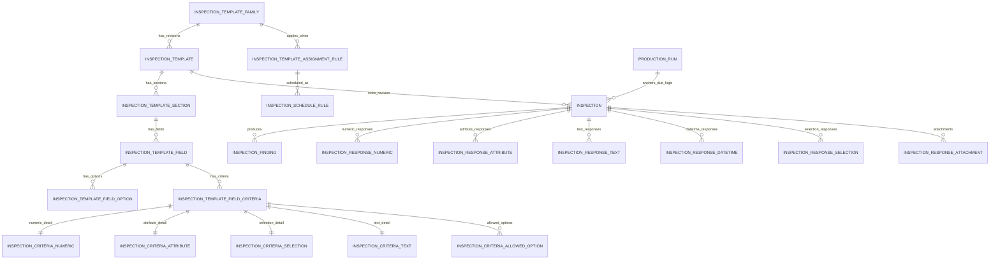

# Deliverable 1: Database Schema Design

This deliverable is split across:
- This markdown overview (design intent + relationship overview)
- SQL package files in `db/migrations/` (must be reconciled with final adjudication blockers before execution)

---

## Schema Assignment Rationale

A new schema is introduced:

- `inspection` — Quality Inspection Forms module (templates, assignments, schedules, instances, responses)

Existing schemas are reused as-is:
- `dbo` — Plant/Customer/Part/Line/Equipment/Lookup/Document
- `quality` — NCR linkage
- `workflow` — approvals and status history
- `security` — RLS predicates and policy engine
- `audit` — history tables for temporal retention

---

## Entity Relationship Overview

---

## Table Inventory

### Template definition (controlled document)

- `inspection.InspectionTemplateFamily`
- `inspection.InspectionTemplate` (revision)
- `inspection.InspectionTemplateSection`
- `inspection.InspectionTemplateField`
- `inspection.InspectionTemplateFieldOption`
- `inspection.InspectionTemplateFieldCriteria`
- `inspection.InspectionCriteriaNumeric`
- `inspection.InspectionCriteriaAttribute`
- `inspection.InspectionCriteriaSelection`
- `inspection.InspectionCriteriaAllowedOption`
- `inspection.InspectionCriteriaText`

### Assignment + scheduling

- `inspection.InspectionTemplateAssignmentRule`
- `inspection.InspectionScheduleRule`

### Execution context + records

- `inspection.ProductionRun`
- `inspection.Inspection`
- `inspection.InspectionFinding`
- `inspection.InspectionNcrLink`

### Typed responses (strongly typed; no EAV)

- `inspection.InspectionResponseNumeric`
- `inspection.InspectionResponseAttribute`
- `inspection.InspectionResponseText`
- `inspection.InspectionResponseDateTime`
- `inspection.InspectionResponseSelection`
- `inspection.InspectionResponseAttachment`

---

## Temporal Versioning Plan

**Temporal ON (7 years):**
- All template definition entities (family/revision/sections/fields/options/criteria)
- All execution entities (runs/inspections/responses/findings)

**Temporal OFF:**
- `inspection.InspectionNcrLink` (immutable link table)

---

## RLS Policy Plan

All new `inspection.*` tables include `PlantId` and must be included in the existing plant isolation policy:

- Filter predicate: `security.fn_PlantAccessPredicate(PlantId)`
- Block predicate: `security.fn_PlantWriteBlockPredicate(PlantId)` after INSERT and UPDATE

See `db/migrations/155_add_rls_predicates_inspection.sql`.

---

## Migration Sequencing

SQL files are created as individual migrations (idempotent, existence-guarded). Suggested application order:

1. `131_create_inspection_schema.sql`
2. `132_create_inspection_template_family.sql`
3. `133_create_inspection_template_revision.sql`
4. `134_create_inspection_template_section.sql`
5. `135_create_inspection_template_field.sql`
6. `136_create_inspection_template_field_option.sql`
7. `137_create_inspection_field_criteria.sql`
8. `138_create_inspection_criteria_numeric.sql`
9. `139_create_inspection_criteria_attribute.sql`
10. `140_create_inspection_criteria_selection.sql`
11. `141_create_inspection_criteria_allowed_option.sql`
12. `142_create_inspection_criteria_text.sql`
13. `143_create_inspection_assignment_rule.sql`
14. `144_create_inspection_schedule_rule.sql`
15. `145_create_production_run.sql`
16. `146_create_inspection_instance.sql`
17. `147_create_inspection_finding.sql`
18. `148_create_inspection_ncr_link.sql`
19. `149_create_inspection_response_numeric.sql`
20. `150_create_inspection_response_attribute.sql`
21. `151_create_inspection_response_text.sql`
22. `152_create_inspection_response_datetime.sql`
23. `153_create_inspection_response_selection.sql`
24. `154_create_inspection_response_attachment.sql`
25. `155_add_rls_predicates_inspection.sql`
26. `156_seed_lookup_inspection.sql`
27. `157_seed_document_types_inspection.sql`
28. `158_seed_status_codes_inspection.sql` (must be rewritten to explicit live `dbo.StatusCode` contract)
29. `159_workflow_allow_entity_types_inspection.sql`
30. `160_seed_workflow_inspection.sql` (must align to explicit status contract + workflow dispatch readiness)

> Before execution, apply blocker fixes from `Reference_Architecture/Quality_Forms_Module/03_adjudication/quality-forms-module-final-authoritative-review.md` (especially 158/159/160 and workflow dispatch handling).  
> If your repository has advanced beyond migration 130, renumber sequentially from live highest migration. Do not alter already-deployed migration files.
