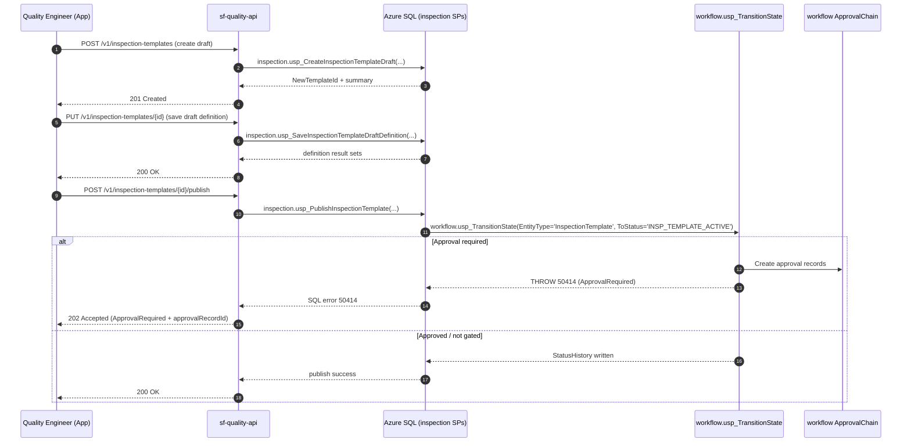
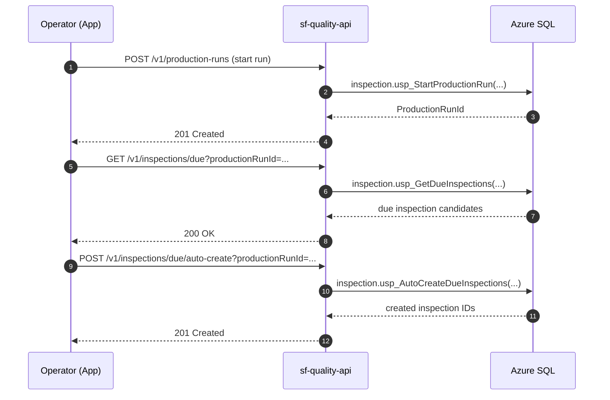
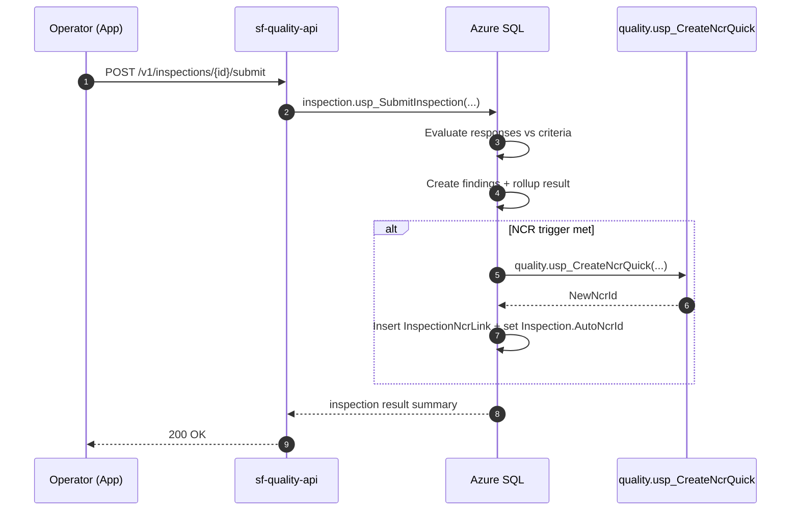

# Deliverable 5: Integration Architecture

This document describes how the Inspection Forms module integrates with:
- Workflow (approval + status history)
- NCR (auto-create and linkage)
- Document system (attachments)
- Scheduling (due evaluation) without MES signals (v1)
- Audit/temporal retention

Endpoint examples use versioned API routes (`/v1/...`).

---

## Integration: Template → Approval → Publish

---

## Integration: Scheduling → Due Queue (v1 manual production run)

---

## Integration: Submit Inspection → Evaluate → Optional NCR auto-create

---

## Data Flow: Control Plan & Standard References

- A template revision is a controlled document:
  - `inspection.InspectionTemplate.DocumentId` (template document record)
- Field-level references:
  - `inspection.InspectionTemplateField.ControlPlanReferenceDocumentId`
  - `inspection.InspectionTemplateField.StandardReferenceDocumentId`

This avoids blocking on APQP/ControlPlan tables while still meeting document control expectations.

---

## Data Flow: Attachments / Photos

- Upload flow (recommended):
  1. Create `dbo.Document` metadata record (DB SP)
  2. API returns upload target (Blob SAS) and DocumentId
  3. Client uploads directly to Blob
  4. Finalize metadata (size/hash/content-type) with DB SP
  5. Link to inspection field via `inspection.InspectionResponseAttachment`

Database stores references; blob holds the bytes.

---

## Security Model (role intent)

Recommended permissions:
- Template authoring: create/edit/publish/retire
- Execution: fill/save/submit
- Review: approve/reject
- Analytics: view results, export SPC

Enforce permissions in SQL via existing `security.usp_EvaluatePolicy`.

---

## Audit & Retention

- Controlled document history: system-versioned temporal tables on template entities.
- Execution history: system-versioned temporal tables on inspections and responses.
- State transitions: immutable `workflow.StatusHistory` audit trail.

This supports “show me records for part X on line Y for last 6 months” queries without manual file chasing.
